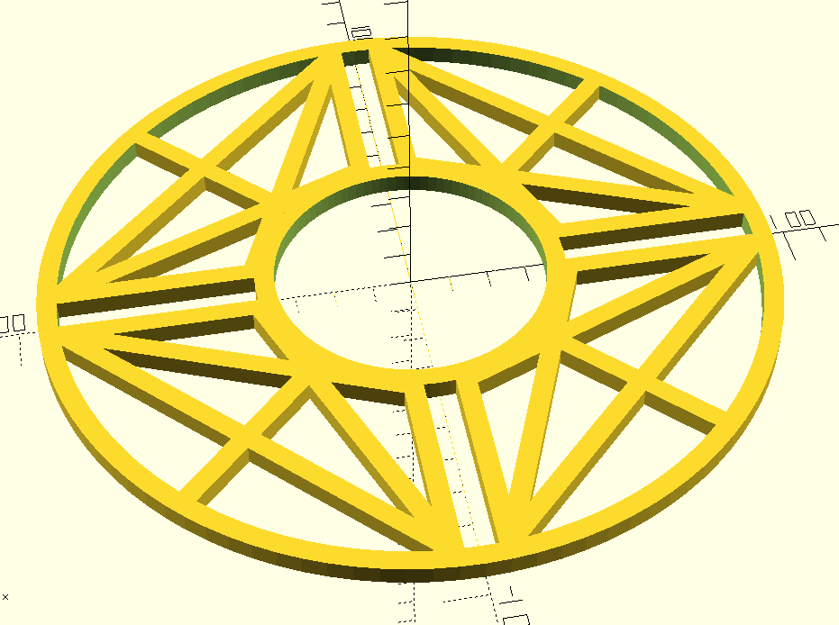

# Universal 4-Bolt Chain Guard

A 3D-printable chain guard designed to mount on 4-bolt chainring spiders for mountain bikes. This guard rotates with your cranks and prevents trouser legs from touching chain oil and grease.

## Design Philosophy

This chain guard uses a **universal mounting system** rather than being designed for one specific chainring. The four radial struts feature parallel rail slots that allow M8 bolts to slide and adjust to different Bolt Circle Diameter (BCD) patterns. This means one design can fit multiple chainring configurations without reprinting.

## Features

- **Universal 4-bolt compatibility**: Adjustable slots accommodate common MTB BCD patterns (94mm-110mm)
- **Parametric design**: All dimensions can be adjusted in the OpenSCAD code
- **Structural reinforcement**: Diagonal cross-bracing, radial struts, and chord connectors provide strength
- **Rotating guard**: Mounts to chainring spider and rotates with cranks
- **Open source**: Fully customizable OpenSCAD source included

## Specifications

- **Mounting**: 4 × M8 bolts (replaces existing chainring bolts)
- **Outer diameter**: 190mm
- **Inner diameter**: 70mm
- **Wall thickness**: 5mm throughout
- **Bolt channel gap**: 8mm (for M8 bolt shaft)
- **Material**: PLA, PETG, or ABS recommended

## Design Details



### Structure
- **Two concentric rings**: Inner (70-80mm) and outer (180-190mm) rings provide rigid boundaries
- **Four bolt channels**: Each strut has two 5mm walls with 8mm gap for bolt positioning
- **Reinforcement elements**:
  - Diagonal X-pattern bracing between channels
  - Radial struts at 45° offsets
  - Straight chord connectors at outer ring

### Why This Design?
Traditional chain guards often mount to the frame and require precise measurements for a specific bike. This design:
1. Mounts directly to the chainring (universal mounting point)
2. Uses adjustable bolt slots (fits multiple BCD patterns)
3. Rotates with cranks (no frame interference)
4. Provides protection exactly where needed (at the chain/gear interface)

## Printing Guidelines

### Recommended Settings
- **Layer height**: 0.2mm
- **Infill**: 100% (high strength needed due to rotating forces)
- **Supports**: May be needed depending on printer orientation
- **Orientation**: Print flat (5mm height is the Z-axis)
- **Material**: PETG recommended for outdoor durability; PLA acceptable for testing

### Post-Processing
1. Remove any support material carefully
2. Test fit bolt channels with M8 bolts before installation
3. Check that bolt heads/nuts can clamp properly
4. Smooth any rough edges that might snag fabric

## Installation

1. Remove existing chainring bolts
2. Place chain guard over chainring spider
3. Align strut channels approximately with bolt holes
4. Insert M8 bolts through channels and into chainring threads
5. Slide bolts radially until they align with mounting holes
6. Tighten bolts securely (guard clamps between spider and crank arm)
7. Test rotation - guard should spin freely with cranks

## Customization

All parameters can be adjusted at the top of the `.scad` file:

```openscad
outer_rim_diameter = 190;  // Adjust for more/less coverage
inner_rim_diameter = 70;   // Adjust for chainring clearance
thickness = 5;             // Adjust structural thickness
bolt_diameter = 8;         // Change for different bolt sizes
```

## Development Notes

This design was created for a Trek Cobia mountain bike but should work with most 4-bolt chainring systems. The universal slot design emerged from the realization that precise BCD measurements are difficult to obtain and vary between manufacturers.

### Tested On
- Trek Cobia MTB with 4-bolt chainring (104mm BCD estimated)

### Not Yet Tested
- Long-term durability under riding conditions
- Compatibility with front derailleurs
- Extreme BCD variations (very small or very large)

## Contributing

Improvements welcome! Areas for potential enhancement:
- Testing on different bike models and BCD patterns
- Optimizing wall thickness for weight vs. strength
- Adding mounting options for non-rotating frame attachment
- Aesthetic improvements while maintaining function

## License

This project is open source. Feel free to modify, remix, and share. Attribution appreciated but not required.

## Acknowledgments

Designed in OpenSCAD for the open-source 3D printing community. Created to solve a simple problem: keeping pants clean while cycling.

## Files

- `chain-guard.scad` - OpenSCAD source file (fully parametric)
- `chain-guard.stl` - Ready-to-print STL file
- `chain-guard.3mf` - 3MF format (recommended)

---

**Version**: 1.0  
**Created**: December 2025  
**Design Tool**: OpenSCAD  
**Platform**: Linux Mint

*Happy printing and clean pants riding! 🚴*

-----------

Ai assisted crafting using Claude from Anthropic.


